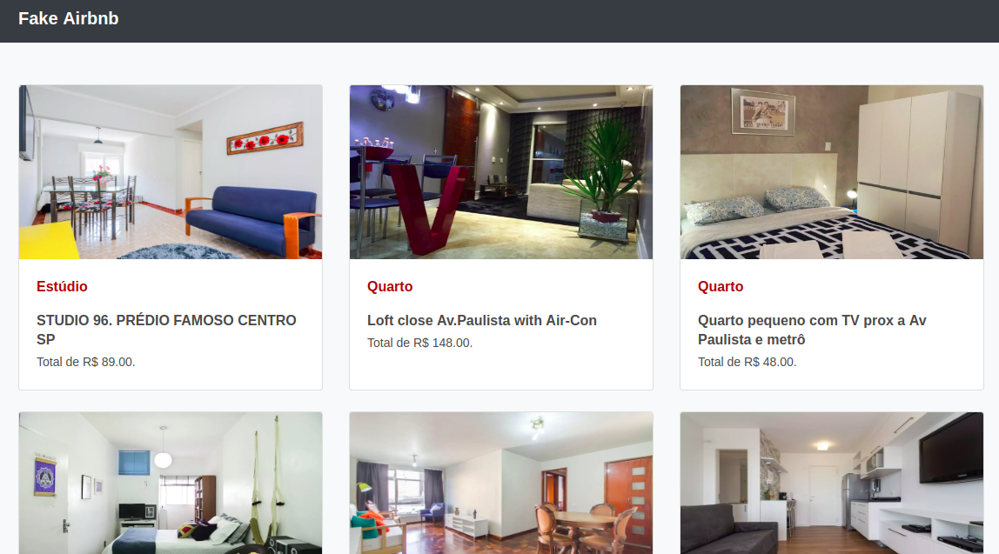

# Fake Airbnb

Site criado utilizando DOM e consumo de API

## Descrição

Display em cards exibidos lado a lado contendo: 

- Cabeçalho
- Cards com:
  - Foto da propriedade
  - Tipo da propriedade
  - Nome da propriedade
  - Preço da propriedade
- Rodapé

Os dados dos cards são exibidos através de uma requisição em API externa.

## Agradecimentos
@douglasmaiabr, ex-aluno do Gama Experience que mantém disponibilizado a API para consulta.
